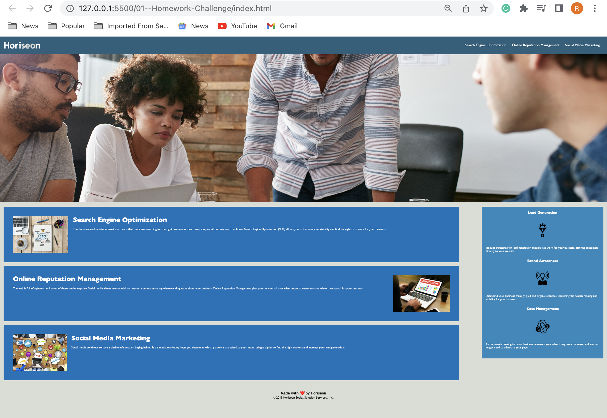

# 01--Homework-Challenge

## This is my first homework assignment. 

### Submission Details 
- To complete this assignment, I changed the non-semantic HTML into semantic HTML. Semantic HTML pages are more adaptable and allow browsers and search engines to interpret the content in the page. In short, it helps screen readers to understand the layout of the page and navigate it. This is important because it helps break the page into identified parts.
- Semantic HTML has a more readable source code, making it easier for developers understand. 
- I used the header, nav, section, article, and aside tags.
- Submitted by Rachel McAllister

